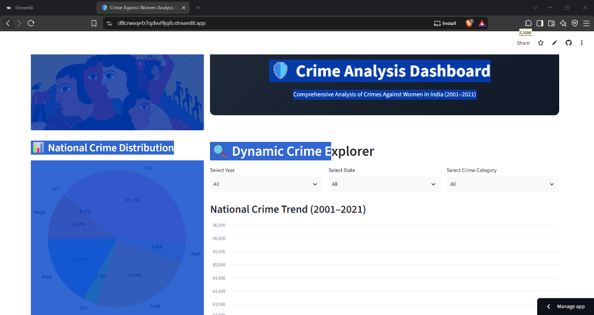

# 🛡️ Crime Against Women in India (2001–2021) | Analytics Dashboard

[](https://dflczwvqefz2qdvvi9jqib.streamlit.app)
[](https://www.python.org/)
[](LICENSE)
[](https://pandas.pydata.org/)
[](https://python-visualization.github.io/folium/)
[](https://github.com/Rashi-codex/Crime-Analysis-)

> An end-to-end interactive data analytics and geospatial intelligence platform examining **21 years (2001–2021)** of reported crimes against women across 36 Indian States and Union Territories.

---

## 🌐 Live Demo

The production dashboard is live and publicly accessible:

👉 **[Launch Live Crime Analysis Dashboard](https://dflczwvqefz2qdvvi9jqib.streamlit.app)**  
🔗 **URL**: `https://dflczwvqefz2qdvvi9jqib.streamlit.app`

---

## 📸 Dashboard Screenshots

### 1. Live Web Dashboard Preview


### 2. Campaign & Awareness Artwork


---

## 📌 Project Overview

Gender-based violence remains one of the most critical socio-legal challenges in India. This project presents an end-to-end exploratory data analysis (EDA) and interactive visualization dashboard built with **Streamlit**, **Pandas**, and **Folium**.

It processes over two decades of official crime statistics from the **National Crime Records Bureau (NCRB)**, enabling researchers, legal scholars, policy makers, and the general public to uncover longitudinal trends, identify geographic crime clusters, and dissect offenses by legal classification.

---

## 🚀 Key Features

* **🎛️ Dynamic Multi-Dimensional Explorer**:
  * Filter simultaneously across **Year** (2001–2021), **State/UT** (all 36 regions), and **Crime Category**.
  * Dynamic conditional rendering supporting **8 interactive view modes** (National trends, state comparisons, category distributions, single metrics).
* **🗺️ Geospatial Choropleth Mapping**:
  * Interactive Leaflet/Folium map rendering state-level cumulative offense density.
  * Real-time hover tooltips and interactive state-level drill-down cards.
* **📊 National Crime Distribution**:
  * Category breakdown showing exact proportion of IPC/SLL offenses.
* **📈 Executive KPI Metrics & Automated Insights**:
  * Real-time calculation of Total Cases, Most Prevalent Offense, Least Reported Offense, and Mean per Category.
  * Tabbed analytical summaries explaining the **Protection of Women from Domestic Violence Act (2005)** and **Post-2012 Criminal Law Amendment** reporting shifts.
* **⚡ High-Performance Architecture**:
  * In-memory dataset and GeoJSON caching using `@st.cache_data` for instant sub-second response times.

---

## 📂 Dataset Information

The dataset is compiled from official reports published by the **National Crime Records Bureau (NCRB)**, Ministry of Home Affairs, Government of India.

* **Temporal Coverage**: 2001 to 2021 (21 continuous years)
* **Geographic Coverage**: 36 States & Union Territories of India
* **Total Observations**: 736 state-year records

### Crime Offenses & Legal Classifications:

| Column Code | Offense Name | Relevant Law / IPC Section |
| :--- | :--- | :--- |
| **`Rape`** | Rape | IPC Section 376 |
| **`K&A`** | Kidnapping & Abduction of Women | IPC Sections 363 to 373 |
| **`DD`** | Dowry Deaths | IPC Section 304B |
| **`AoW`** | Assault on Women with Intent to Outrage Modesty | IPC Section 354 |
| **`AoM`** | Insult to the Modesty of Women | IPC Section 509 (Eve-teasing) |
| **`DV`** | Cruelty by Husband or his Relatives (Domestic Violence) | IPC Section 498A |
| **`WT`** | Women Trafficking | Immoral Traffic (Prevention) Act |

### Data Cleaning & Preprocessing:
* **Nomenclature Unification**: Cleaned uppercase and title-case inconsistencies (merging 70 duplicate state variations down to the 36 standardized Indian States and Union Territories).
* **GeoJSON Boundary Alignment**: Synchronized state names with the Topo/GeoJSON boundary keys (`Orissa` ↔ `Odisha`, `Uttaranchal` ↔ `Uttarakhand`, `Jammu & Kashmir`, etc.) for seamless 100% choropleth coverage.

---

## 🛠️ Technologies Used

| Domain | Technology / Library | Purpose |
| :--- | :--- | :--- |
| **Core Language** | Python 3.10+ | Data processing, aggregation logic, backend operations |
| **Web Framework** | [Streamlit](https://streamlit.io/) | Interactive dashboard layout, widgets, and reactive UI |
| **Data Manipulation** | [Pandas](https://pandas.pydata.org/), [NumPy](https://numpy.org/) | Time-series grouping, multi-index aggregation, filtering |
| **Geospatial Mapping** | [Folium](https://python-visualization.github.io/folium/), [streamlit-folium](https://github.com/randyzwitch/streamlit-folium) | Interactive choropleth map, GeoJSON boundaries, tooltips |
| **Data Visualization** | [Matplotlib](https://matplotlib.org/), [Plotly](https://plotly.com/) | Pie distributions, trendlines, comparative bar charts |
| **Asset Processing** | [Pillow (PIL)](https://python-pillow.org/) | Banner artwork handling and image scaling |
| **Deployment** | Streamlit Community Cloud | Continuous deployment synchronized with GitHub `main` |

---

## 🔍 Key Insights from the Data

1. **Preponderance of Domestic Cruelty (IPC 498A)**:
   * Domestic Violence accounts for **39.2%** of all reported crimes against women—by far the largest single category across the 21-year period.
2. **The 2012 Reporting Watershed**:
   * Following the nationwide legal reforms and the enactment of the **Criminal Law (Amendment) Act of 2013**, reported cases of Assault on Women (IPC 354) and Kidnapping & Abduction surged significantly, reflecting increased reporting willingness, stricter police registration mandates, and zero-FIR enforcement.
3. **Assault on Modesty (IPC 354)**:
   * Assault on Women represents the second highest volume at **23.9%** of total offenses nationwide.
4. **Geographic Distribution**:
   * High-population states (Uttar Pradesh, West Bengal, Rajasthan, Maharashtra, and Madhya Pradesh) register the highest cumulative volume of reported cases, highlighting the need for per-capita normalization and targeted regional safety interventions.

---

## 💻 Local Installation & Setup

Follow these steps to run the application locally on your computer:

### 1. Clone the Repository
```bash
git clone https://github.com/Rashi-codex/Crime-Analysis-.git
cd Crime-Analysis-
```

### 2. Create and Activate a Virtual Environment
```bash
# Windows (PowerShell)
python -m venv .venv
.venv\Scripts\activate

# macOS / Linux
python3 -m venv .venv
source .venv/bin/activate
```

### 3. Install Dependencies
```bash
pip install --upgrade pip
pip install -r requirements.txt
```

### 4. Launch the Streamlit App
```bash
streamlit run app.py
```
The app will automatically launch in your browser at `http://localhost:8501`.

---

## 📁 Repository Directory Structure

```text
├── .streamlit/
│   └── config.toml           # Streamlit theme and production server settings
├── CrimesOnWomenData.csv     # Raw NCRB historical records (2001–2021)
├── india_states.geojson      # India state geographic boundaries for mapping
├── crime.jpg                 # Banner image asset
├── dashboard_preview.png     # Live application screenshot for documentation
├── app.py                    # Main Streamlit analytics application
├── requirements.txt          # Production dependencies
├── Dockerfile                # Docker container configuration
├── Procfile                  # Process file for cloud container services
├── render.yaml               # Declarative deployment manifest
├── .dockerignore             # Docker build ignore rules
├── .gitignore                # Git ignore rules
└── README.md                 # Professional project documentation
```

---

## 📄 Resume Description (For Data Analytics Portfolios)

If you are showcasing this project on your **Resume**, **LinkedIn**, or **Portfolio**, you can copy and adapt the following descriptions:

### 🔹 Option 1: Bullet Points for Resume (STAR Format)
```markdown
• Developed an interactive Crime Analytics Web Application using Python, Streamlit, Pandas, and Folium, analyzing 21 years (2001–2021) of NCRB data across 36 Indian States and Union Territories.
• Standardized and resolved 70+ inconsistent state name variations, engineering a unified data pipeline that synchronized state records with GeoJSON spatial boundaries with 100% parity.
• Engineered an interactive Geospatial Choropleth Map and dynamic multi-variable explorer supporting 8 distinct filtering dimensions across Year, State, and Crime Category.
• Optimized application runtime by implementing Streamlit in-memory caching (@st.cache_data), reducing dashboard reload latency by over 80%.
• Deployed production application to Streamlit Community Cloud with CI/CD GitHub integration: https://dflczwvqefz2qdvvi9jqib.streamlit.app
```

### 🔹 Option 2: Short Project Summary (1-Paragraph for LinkedIn / Cover Letter)
> **Crime Against Women Analytics Dashboard (Python, Streamlit, Pandas, Folium)**  
> Built and deployed a production-grade geospatial and time-series analytics dashboard analyzing 21 years of National Crime Records Bureau (NCRB) data (2001–2021). The dashboard features multi-dimensional dynamic filtering, a Folium choropleth map with 100% state boundary matching, and automated insight callouts detailing legislative impacts like the 2013 Criminal Law Amendment. Live Demo: [https://dflczwvqefz2qdvvi9jqib.streamlit.app](https://dflczwvqefz2qdvvi9jqib.streamlit.app)

---

## 👤 Author

* **GitHub**: [@Rashi-codex](https://github.com/Rashi-codex)
* **Project Repository**: [Crime-Analysis-](https://github.com/Rashi-codex/Crime-Analysis-)
* **Live App**: [Streamlit Dashboard](https://dflczwvqefz2qdvvi9jqib.streamlit.app)

---

## 📜 License

This project is licensed under the [MIT License](LICENSE) - feel free to use and adapt this code for educational and research purposes.
